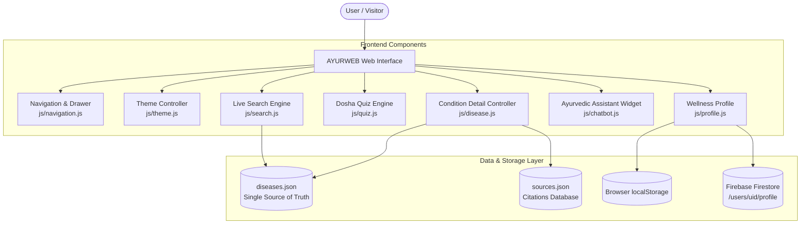

# 🌿 AYURWEB — Modern Ayurveda & Evidence-Based Health Education Platform

[-yellow.svg)](https://developer.mozilla.org/en-US/docs/Web/JavaScript)
[](https://developer.mozilla.org/en-US/docs/Web/CSS)
[](https://firebase.google.com/)
[](#-sources--evidence-citations)

> **AYURWEB** is an interactive, modern web application designed to bridge traditional Ayurvedic health wisdom (*Tridosha* balance, dietary guidelines, lifestyle routines, herbal remedies) with contemporary evidence-based medicine, clinical safety precautions, and high-visibility medical emergency warnings.

---

## 📋 Table of Contents

- [✨ Key Features](#-key-features)
- [🔬 The Evidence Lens](#-the-evidence-lens)
- [🏗️ System Architecture & Data Flow](#️-system-architecture--data-flow)
- [📁 Directory Structure](#-directory-structure)
- [💻 Technology Stack](#-technology-stack)
- [🩺 Health Categories & Conditions Covered](#-health-categories--conditions-covered)
- [🛡️ Medical Safety & Severity Spectrum](#️-medical-safety--severity-spectrum)
- [🔍 Single Source of Truth Data Architecture](#-single-source-of-truth-data-architecture)
- [🚀 Quick Start & Local Setup](#-quick-start--local-setup)
- [🔒 Firestore Security Rules](#-firestore-security-rules)
- [📚 Sources & Evidence Citations](#-sources--evidence-citations)
- [⚠️ Educational Disclaimer](#️-educational-disclaimer)

---

## ✨ Key Features

### 🔍 1. Real-Time Live Search & Autocomplete (`js/search.js`)
- Instant client-side search across 34 health conditions, Sanskrit terminology, synonyms, symptoms, dosha types, and health categories.
- Smart dropdown auto-suggestions showing condition severity, dosha alignment, and direct navigational links.

### 📜 2. Dynamic Condition Detail Engine (`disease.html` & `js/disease.js`)
- URL parameter-driven view (`disease.html?id=<condition_id>`) rendering standardized health information.
- Sticky sub-navigation bar allowing smooth scrolling across Overview, Symptoms, Red-Flag Warning Signs, Self-Care, Ayurvedic Approaches, Diet & Lifestyle, Safety & Evidence, and Referenced Citations.
- Tailored **Urgent Emergency Alerts** for high-risk conditions (e.g., Rabies / Animal Bites) with direct one-touch emergency call actions.

### 🔬 3. Evidence Lens & Safety Lens
- Transparently distinguishes traditional Ayurvedic practices from clinical evidence levels, safety considerations, contraindications, potential herb-drug interactions, and primary citations.

### 🧘 4. Interactive Prakriti (Dosha) Quiz (`js/quiz.js`)
- Interactive 5-question self-assessment analyzing physical frame, digestion (*Agni*), sleep patterns, climate sensitivity, and emotional response.
- Dynamic scoring algorithm calculating percentage breakdowns for **Vata**, **Pitta**, and **Kapha** doshas with personalized health and dietary recommendations.

### 👤 5. Personalized Wellness Profile (`js/profile.js`)
- Captures basic wellness and lifestyle information, digestion capacity (*Agni*), dietary preferences, and primary health concerns.
- Dual storage synchronization: saves profile data locally in browser `localStorage` and synchronizes remotely with user-isolated **Firebase Firestore** documents (`/users/{uid}/profile/main`).

### 💬 6. Ayurvedic Assistant Widget (`js/chatbot.js`)
- Interactive floating widget offering instant guidance on home remedies, emergency warning sign triage, dietary advice, and direct links to specific condition pages.

### 🌙 7. Glassmorphic Design & Dark Mode (`js/theme.js`)
- Built with a modern glassmorphic visual language, smooth CSS micro-animations, and responsive layout grids.
- Persistent light/dark mode theme toggler stored in `localStorage`.

---

## 🔬 The Evidence Lens

AYURWEB explicitly separates traditional wellness principles from modern scientific evidence and safety considerations:

| Dimension | Explanation |
| :--- | :--- |
| **Traditional Knowledge** | Historical Ayurvedic principles (*Pitta/Vata/Kapha*), classical formulations, and dietary energetics. |
| **Evidence Level** | Clearly labeled evidence rating (*limited*, *moderate*, or *established*) based on current literature. |
| **Safety Considerations** | Explicit alerts for organ safety precautions, contraindications, and known risks. |
| **Referenced Citations** | Direct links to WHO, NCCIH (NIH), Ministry of AYUSH, and PubMed research. |

---

## 🏗️ System Architecture & Data Flow



---

## 📁 Directory Structure

```
Ayurweb/
├── index.html                # Main Homepage (Hero Search, Quick Access, Categories)
├── disease.html              # Dynamic Condition Detail Template Page
├── styles.css                # Master Design System Entry Point (Imports css/*.css)
├── css/                      # Modular CSS Architecture
│   ├── variables.css         # CSS Tokens, Color Palettes, Theme Variables
│   ├── base.css              # Reset, Typography, Core Utilities
│   ├── layout.css            # Sticky Navbar, Drawer, Page Containers, Footer
│   ├── components.css        # Cards, Buttons, Search Field, Chatbot, Modals
│   ├── forms.css             # Form Controls, Wellness Profile Dashboard
│   ├── disease.css           # Condition Detail Page, Warning Callouts, Section Nav
│   └── responsive.css        # Responsive Breakpoints (Mobile, Tablet, Desktop)
├── js/                       # Modular JavaScript Controllers
│   ├── app.js                # App Coordinator & Active Nav Link Highlighter
│   ├── chatbot.js            # Ayurvedic Assistant Logic & Safety Guidance
│   ├── disease.js            # Condition Detail Controller & JSON Renderer
│   ├── firebase.js           # Firebase Init, Anonymous Auth & Firestore Config
│   ├── navigation.js         # Mobile Drawer & Sticky Scroll Navbar Logic
│   ├── profile.js            # Wellness Profile Form Controller & Firestore Sync
│   ├── quiz.js               # Prakriti (Dosha) Quiz Engine & Result Scoring
│   ├── search.js             # Live Search Engine & Autocomplete Handler
│   └── theme.js              # Light/Dark Theme Controller & Persistence
├── pages/                    # Sub-pages Directory
│   ├── categories.html       # 34 Conditions Index with Category Filters
│   ├── contact.html          # Contact, Feedback & Inquiry Form
│   ├── guide.html            # Tridosha Ayurveda Principles & Interactive Quiz
│   └── profile.html          # Interactive Wellness Profile Dashboard
├── data/                     # Central Data Repositories
│   ├── diseases.json         # 34 Standardized Condition Datasets (Single Source of Truth)
│   └── sources.json          # Medical Citations & Source Organizations Database
└── assets/                   # Visual Media Assets & Brand Graphics
```

---

## 💻 Technology Stack

| Layer | Technologies Used |
| :--- | :--- |
| **Frontend Core** | HTML5, Native Vanilla JavaScript (ES6 Modules/Scripts) |
| **Styling & Design** | Vanilla CSS3 (Custom Properties/Variables), Glassmorphic Elements, FontAwesome 5.15 Icons |
| **Database & Cloud** | Firebase Firestore NoSQL Database, LocalStorage Offline Fallback Mode |
| **Authentication** | Firebase Anonymous Authentication (`signInAnonymously`) |
| **Typography** | Modern System Sans-Serif Stack with High Legibility Hierarchy |

---

## 🩺 Health Categories & Conditions Covered

AYURWEB provides standardized educational data for **34 health conditions** categorized as follows:

| Category | Count | Conditions Included |
| :--- | :---: | :--- |
| 🫁 **Common Ailments** | 15 | Cold & Cough (*Kasa*), Indigestion (*Ajirna*), Acidity (*Amlapitta*), Headache (*Shirashoola*), Joint Pain (*Sandhivata*), Constipation (*Anaha*), Skin Rashes, Toothache, Fever (*Jwara*), Back Pain, Sinusitis, Typhoid, Malaria, Diarrhea, Piles (*Arshas*) |
| 🩺 **Respiratory & Chronic** | 8 | Asthma (*Shwasa*), COPD, Anemia, Diabetes (*Prameha*), Hypertension, Thyroid Disorders, Pneumonia, Cancer |
| 🧘 **Lifestyle & Mind-Body** | 3 | Obesity (*Stholya*), Depression, Jaundice |
| 🧬 **Rare & Genetic** | 4 | Cystic Fibrosis, Hemophilia, Ehlers-Danlos Syndrome, Guillain-Barré Syndrome (GBS) |
| 🚨 **Emergency & Acute Care** | 4 | Rabies, Animal Bites, Burns, Chikungunya |

> **Total:** 34 Conditions Structured in `data/diseases.json`.

---

## 🛡️ Medical Safety & Severity Spectrum

To promote responsible health literacy, every condition on AYURWEB is tagged with an explicit severity indicator:

```
🟢 GREEN  ── General Information (Suitable for home supportive care)
🟡 YELLOW ── Clinical Guidance Advised (Chronic/moderate conditions requiring professional oversight)
🔴 RED    ── URGENT MEDICAL EMERGENCY (Mandatory emergency hospital / ER evaluation required)
```

> [!WARNING]
> High-visibility warning signs (red-flag symptoms) are **never hidden in accordions or tabs**. They are permanently rendered in high-visibility warning callout boxes on condition pages to ensure immediate user awareness.

---

## 🔍 Single Source of Truth Data Architecture

All health information is stored in `data/diseases.json`. Each condition entry strictly follows this JSON schema:

```json
{
  "id": "fever",
  "name": "Fever",
  "traditionalName": "Jwara",
  "category": "common",
  "dosha": "Pitta",
  "severity": "green",
  "severityText": "🟢 GENERAL INFORMATION: Self-care information may be appropriate.",
  "icon": "fa-thermometer-half",
  "synonyms": ["High Temperature", "Pyrexia", "Body Heat"],
  "overview": "In Ayurveda, Fever (Jwara) is considered a disturbance of Pitta dosha and Agni...",
  "symptoms": ["Elevated body temperature", "Body aches & chills", "Loss of appetite"],
  "warningSigns": ["Fever above 39°C (102°F) lasting > 3 days", "Stiff neck or severe confusion"],
  "selfCare": ["Bed rest", "Hydration with warm coriander seed water", "Sponge baths"],
  "ayurvedicApproaches": [
    {
      "name": "Sudarshan Churna",
      "type": "herbal_formulation",
      "purpose": "Traditional supportive fever management",
      "evidenceLevel": "limited",
      "safety": "Traditional formulation. Use under guidance.",
      "contraindications": ["Pregnancy without oversight"],
      "sourceIds": ["AYUSH-001", "NCCIH-001"]
    }
  ],
  "diet": ["Light mung dal soup", "Warm water", "Avoid cold drinks & heavy foods"],
  "yoga": ["Shitali Pranayama", "Gentle rest"],
  "whenToSeekHelp": "Consult a physician if fever remains elevated or persistent.",
  "emergency": {
    "required": false,
    "notice": null,
    "action": null
  },
  "safety": {
    "evidenceLevel": "moderate",
    "knownRisks": ["Dehydration", "Gastrointestinal sensitivity"],
    "contraindications": ["Acute organ impairment"]
  },
  "sources": ["AYUSH-001", "NCCIH-001", "WHO-TM-001"]
}
```

---

## 🚀 Quick Start & Local Setup

A local HTTP server is recommended because AYURWEB dynamically fetches JSON datasets (`data/diseases.json` and `data/sources.json`), which browser CORS security policies may block when opening files directly using `file:///` URLs.

### Option 1: Using Python (Recommended)
1. Clone or download the repository:
   ```bash
   git clone https://github.com/Chaitanya-gang/Ayurweb.git
   cd Ayurweb
   ```
2. Start a local HTTP server:
   ```bash
   python -m http.server 8000
   ```
3. Open `http://localhost:8000` in your web browser.

### Option 2: Using VS Code Live Server
1. Open the project folder in Visual Studio Code.
2. Right-click `index.html` and select **"Open with Live Server"**.

---

## 🔒 Firestore Security Rules

### Recommended Firestore Security Rules
These rules should be deployed in your Firebase Console before using Firestore with real user data to ensure user-isolated profile access:

```javascript
rules_version = '2';
service cloud.firestore {
  match /databases/{database}/documents {
    match /users/{userId}/profile/{document=**} {
      allow read, write: if request.auth != null && request.auth.uid == userId;
    }
  }
}
```

---

## 📚 Sources & Evidence Citations

Every Ayurvedic approach and safety recommendation on AYURWEB references health institutions and research databases indexed in `data/sources.json`:

- 🏛️ **World Health Organization (WHO)** — Traditional & Complementary Medicine Strategy
- 🔬 **National Center for Complementary and Integrative Health (NCCIH / NIH)**
- 🌿 **Ministry of AYUSH**, Government of India — Ayurvedic Pharmacopoeia of India (API)
- 📖 **PubMed Central / NCBI** — Peer-Reviewed Systematic Reviews & Clinical Phytotherapy Research

---

## ⚠️ Educational Disclaimer

> [!IMPORTANT]
> **Educational & Supportive Reference Only**  
> Content provided on **AYURWEB** is strictly for educational, informational, and supportive self-care reference. It does **not** constitute medical advice, clinical diagnosis, or treatment plans. Always consult a qualified healthcare professional or Ayurvedic physician before starting any herbal regimen, especially during pregnancy, lactation, or when managing chronic medical conditions. In case of medical emergencies, immediately contact your local emergency services.

---

<p align="center">
  <strong>AYURWEB</strong> — Modern Ayurveda & Responsible Health Education Platform
</p>
